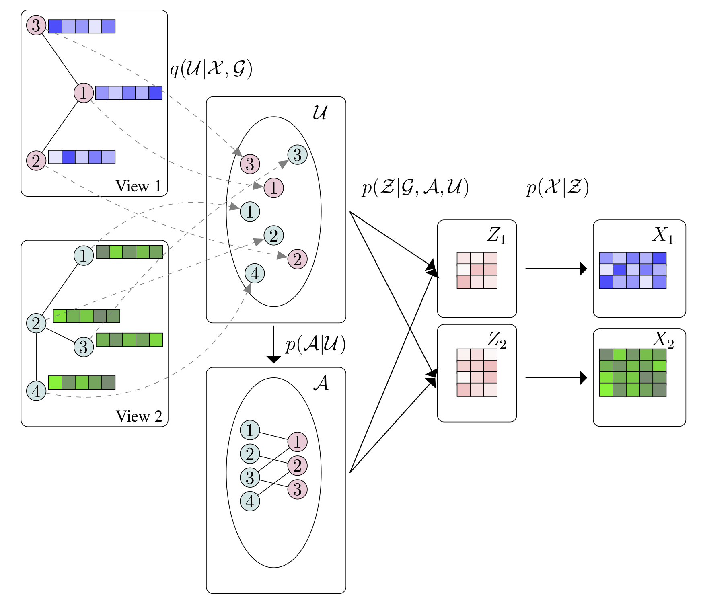

Bayesian Relational Learning
============

This is a TensorFlow implementation of the BayReL model as described in our paper [BayReL: Bayesian Relational Learning for Multi-omics Data Integration](https://arxiv.org/pdf/2010.05895.pdf) appeared in 34th Conference on Neural Information Processing Systems (NeurIPS 2020).




**Abstract:** High-throughput molecular profiling technologies have produced high-dimensional multi-omics data, enabling systematic understanding of living systems at the genome scale. Studying molecular interactions across different data types helps reveal signal transduction mechanisms across different classes of molecules. In this paper, we develop a novel Bayesian representation learning method that infers the relational interactions across multi-omics data types. Our method, Bayesian Relational Learning (BayReL) for multi-omics data integration, takes advantage of a priori known relationships among the same class of molecules, modeled as a graph at each corresponding view, to learn view-specific latent variables as well as a multi-partite graph that encodes the interactions across views. Our experiments on several real-world datasets demonstrate enhanced performance of BayReL in inferring meaningful interactions compared to existing baselines.
 
## Requirements
* Python 3.6
* TensorFlow 1.14.0
* tensorflow-probability 0.7.0 
* networkx
* scikit-learn
* scipy
* Please check `requirements.txt` for more details.


## Run the demo

```bash
python bayRel_CF.py
```
